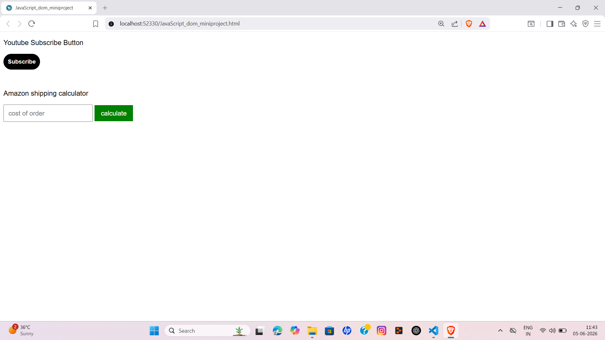
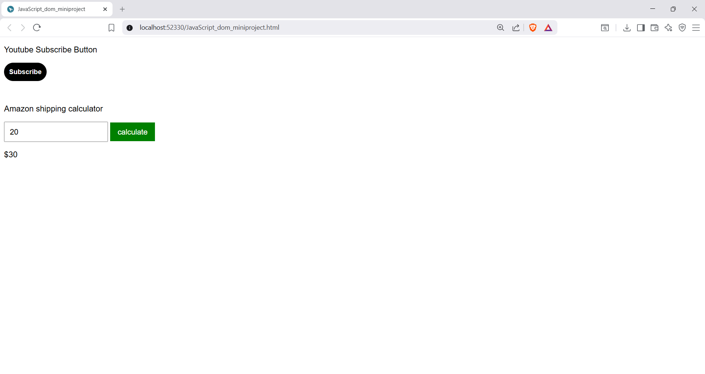

JavaScript Dom Miniproject
--------------------------
This project is a collection of two interactive web components: a YouTube Subscribe button and an Amazon Shipping Calculator. It was developed to strengthen my understanding of JavaScript fundamentals, DOM manipulation, and event-driven programming.

✦ Project Overview
-------------------

This project focuses on building real-world UI interactions using JavaScript. It demonstrates how modern web applications respond instantly to user actions without page refresh.

✦ Screenshots
----------------
Default Interface

Interactive Interface 

✦ Demo
---------
Watch the complete demo video on Linkedin to see the project in action [Watch the Demo on LinkedIn](https://www.linkedin.com/posts/darameghana_%F0%9D%90%89%F0%9D%90%9A%F0%9D%90%AF%F0%9D%90%9A%F0%9D%90%92%F0%9D%90%9C%F0%9D%90%AB%F0%9D%90%A2%F0%9D%90%A9%F0%9D%90%AD%F0%9D%90%83%F0%9D%90%8E%F0%9D%90%8C%F0%9D%90%8C%F0%9D%90%A2%F0%9D%90%A7%F0%9D%90%A2%F0%9D%90%8F%F0%9D%90%AB%F0%9D%90%A8%F0%9D%90%A3%F0%9D%90%9E%F0%9D%90%9C%F0%9D%90%AD-ugcPost-7468625624291753984-VM7j/?utm_source=share&utm_medium=member_desktop&rcm=ACoAAF_WDeEBC0fVi7tVEh3ksFR2CTX--PYKJdo)

✦ Features
------------

• Toggle between Subscribe and Subscribed states
• Dynamic button styling using JavaScript
• Calculate shipping charges based on order value
• Support both button click and keyboard input
• Instantly update results without refreshing the page

✦ Technology Stack
---------------------

• HTML5
• CSS3
• JavaScript (ES6)
• DOM Manipulation
• Event Handling

✦ Application Workflow
-----------------------

• The user interacts with the Subscribe button
• JavaScript checks the current state and updates text and style dynamically
• For the shipping calculator, the user enters the order amount
• The application calculates the final cost by applying shipping charges when required
• The updated result is displayed immediately on the screen

✦ UI & Design Highlights
----------------------------

• Minimal and user-friendly interface
• Rounded interactive buttons
• Simple and responsive layout
• Real-time visual feedback for user actions
• Clean design focused on functionality

✦ Outcomes
------------

Through this project, I gained practical experience in:

• DOM manipulation
• Event handling
• Conditional logic
• Dynamic CSS class updates
• User input processing
• Building interactive frontend applications

✦ Future Enhancements
-------------------------

• Add input validation
• Improve mobile responsiveness
• Store user preferences using Local Storage
• Add smooth animations and transitions
• Expand the collection with more DOM-based mini projects

✦ Key Takeways
----------------

This project is part of my frontend development journey, where I focus on building interactive and user-friendly web applications using HTML, CSS, and JavaScript.
